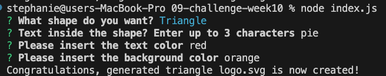
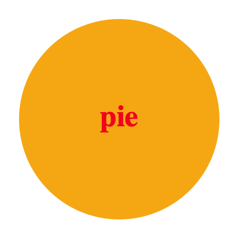
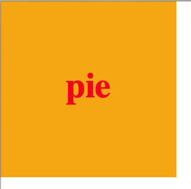
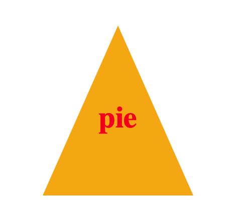

# **Object-Oriented Programming Challenge: SVG Logo Maker**

The purpose of this project was to create build a Node.js command-line application that takes in user input to generate a logo and save it as an SVG file. The application prompts the user to select a color and shape, provide text for the logo, and save the generated SVG to an .svg file.

We were to generate a simple logo for my projects, so that I don't have to pay a graphic designer.

I began by doing research and finding sources -- these videos were equally helpful in various parts of the assignment.

Sources: https://www.youtube.com/watch?v=m9oC3wo6JW4&ab_channel=SanjayChopra

I followed the resources to create the JavaScript file using jest, inquirer, and JSON and using the programs to create different classes.

Here, you can see the questions that you answer from the command line.

Here, you can see the results with the different shapes.

In conclusion, I set up the files to generate a logo.svg automatically and meets the assignemnt criteria by:
- prompting the user for text questions to pop up
- you can enter up to 3 characters
- you can enter a color keyword
- you can be prompted to select a shape and presented with a list of shapes to choose from (a circle, triangle, and square)
- the user then receives an automatically generated logo named logo.svg
- the output text "generated logo.svg" is shown on the command line
- when opening the logo.svg in a browser, it shows the pixel image that matches the criteria entered.

Please follow this link to the GitHub and an additional one to a video presentation: 